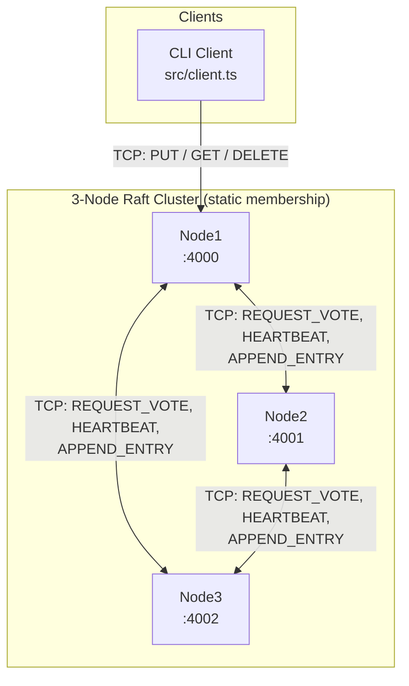
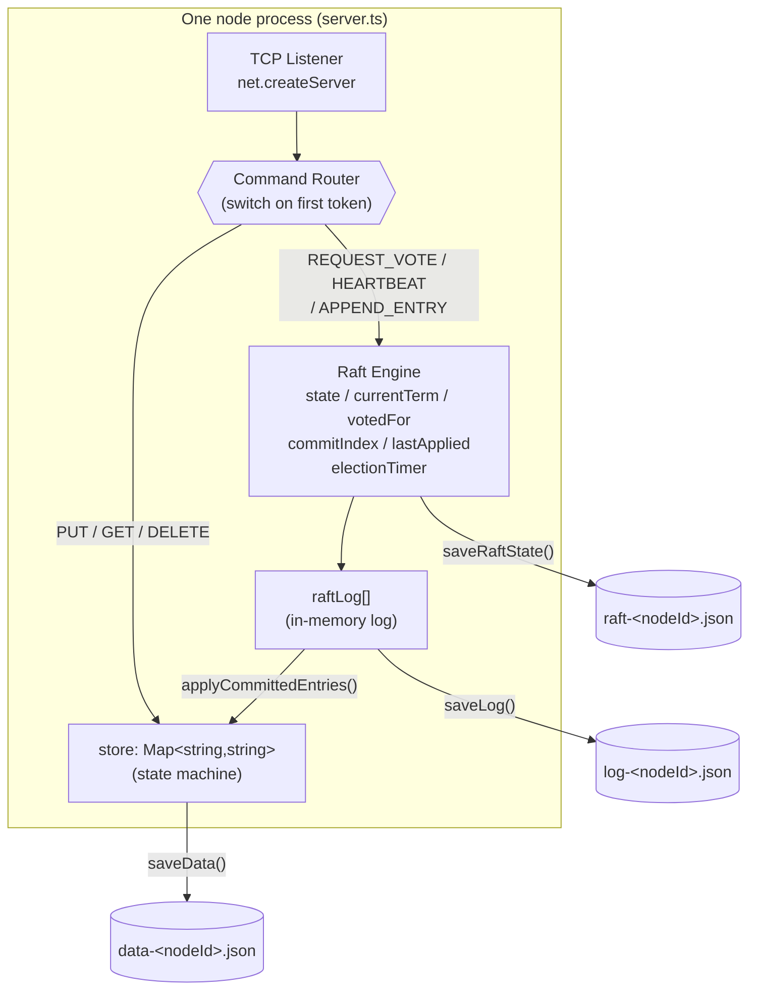
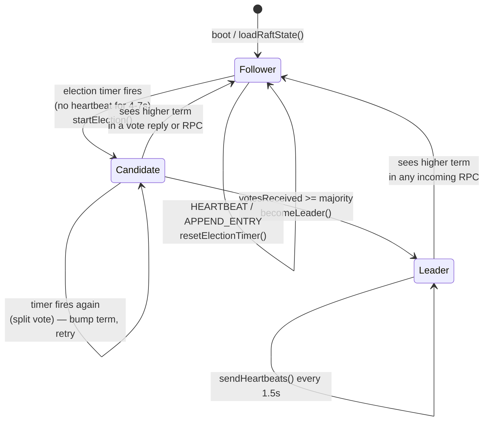
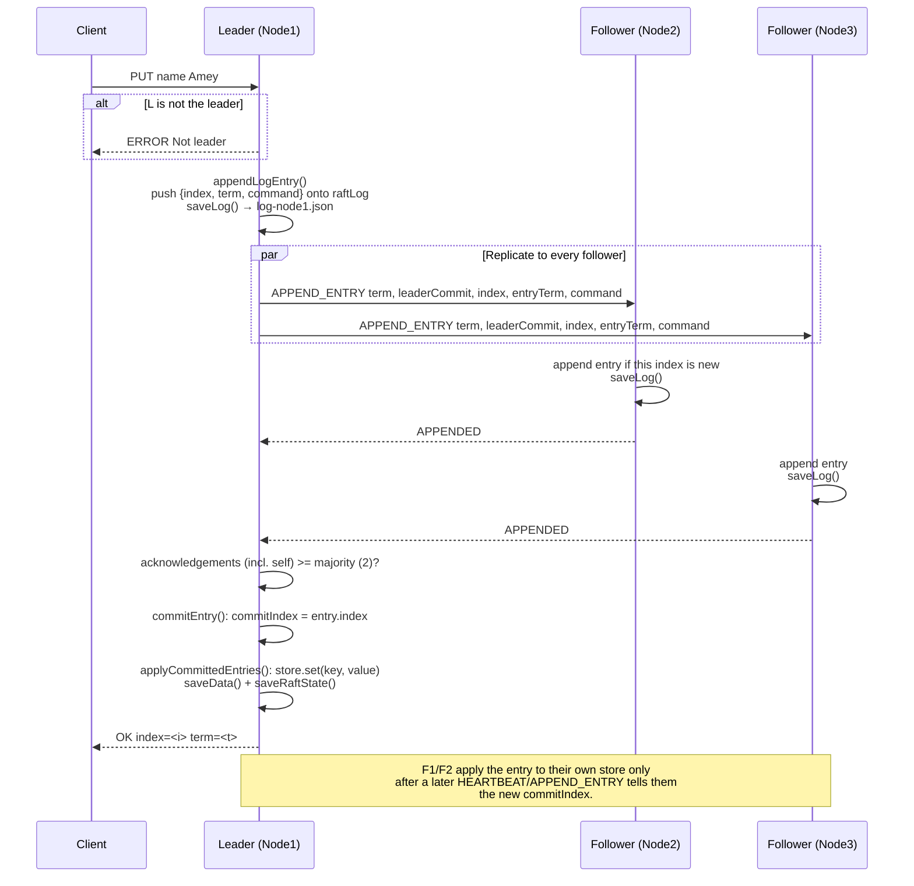
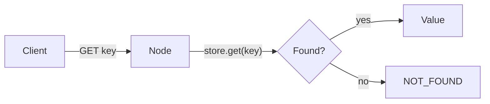
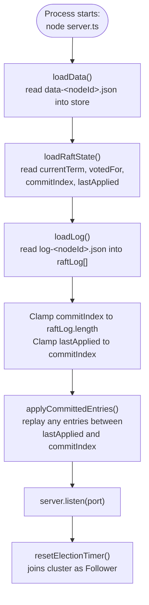

# MiniKV Architecture

This document covers how MiniKV is put together and walks through every major flow: leader election, writes, reads, heartbeats, and crash recovery. It assumes you've read the [README](./README.md) for the wire protocol and file layout.

All diagrams are [Mermaid](https://mermaid.js.org/) and render natively on GitHub.

## Contents

1. [Cluster Topology](#1-cluster-topology)
2. [Single-Node Internals](#2-single-node-internals)
3. [Raft Role State Machine](#3-raft-role-state-machine)
4. [Flow: Leader Election](#4-flow-leader-election)
5. [Flow: Write Path (PUT / DELETE)](#5-flow-write-path-put--delete)
6. [Flow: Read Path (GET)](#6-flow-read-path-get)
7. [Flow: Node Restart & Recovery](#7-flow-node-restart--recovery)
8. [Concept Reference](#8-concept-reference)

---

## 1. Cluster Topology

MiniKV runs as a fixed 3-node cluster. Every node is identical code — the only difference is the `port`/`nodeId` it's started with — and every node plays two roles at once: a **Raft peer** and a **client-facing KV server**. There is no separate coordinator, load balancer, or proxy.



A client can connect to any node. Reads (`GET`) are answered by whichever node receives them. Writes (`PUT`/`DELETE`) only succeed against the current leader — any other node rejects them with `ERROR Not leader`.

## 2. Single-Node Internals

Inside one `server.ts` process, a single TCP listener multiplexes both client commands and Raft RPCs onto the same port. A command router dispatches based on the first token of each line. Three independent JSON files back the three pieces of state that need to survive a restart.



## 3. Raft Role State Machine

Every node is always in exactly one of three states. Transitions are driven by election timeouts, vote counts, and discovering a higher term from any incoming RPC.



Randomized timeouts (`4000 + random * 3000` ms) are what keep two nodes from perpetually tying and triggering split votes forever.

## 4. Flow: Leader Election

Triggered whenever a follower (or candidate) hasn't heard from a leader inside its randomized timeout window.

```mermaid
sequenceDiagram
    participant N1 as Node1
    participant N2 as Node2
    participant N3 as Node3

    Note over N1: Election timer expires (4-7s of silence)
    N1->>N1: state = candidate; currentTerm++<br/>votedFor = self; votesReceived = 1
    N1->>N1: saveRaftState(); resetElectionTimer()

    par Request votes from every other node
        N1->>N2: REQUEST_VOTE term=T, candidateId=N1
        N1->>N3: REQUEST_VOTE term=T, candidateId=N1
    end

    N2->>N2: term > currentTerm → step down,<br/>update term, clear votedFor
    N2->>N2: votedFor is null or N1 → grant
    N2-->>N1: VOTE_GRANTED

    N3->>N3: same checks → grant
    N3-->>N1: VOTE_GRANTED

    N1->>N1: votesReceived = 3 >= majority (2)
    N1->>N1: becomeLeader(); clear election timer

    loop every 1.5s while leader
        N1->>N2: HEARTBEAT term=T, leaderId=N1, commitIndex
        N1->>N3: HEARTBEAT term=T, leaderId=N1, commitIndex
        N2-->>N1: ALIVE
        N3-->>N1: ALIVE
    end
```

Two safety mechanisms shown here:
- **One vote per term** — `votedFor` is only reused across an election if the same candidate asks again; a higher term seen from anyone resets it.
- **Heartbeats double as the commit-index propagation channel** — followers don't find out a write committed until the next `HEARTBEAT`/`APPEND_ENTRY` carries the new `commitIndex`.

## 5. Flow: Write Path (PUT / DELETE)

A write is only accepted by the leader. It must be durably appended locally, replicated to a majority, and only then applied to the state machine and acknowledged to the client.



If fewer than a majority of followers acknowledge (e.g. a network partition), the leader responds `ERROR Majority not reached` — but note the entry is already sitting in the leader's own `raftLog` regardless of the outcome. See [Concept Reference](#8-concept-reference) for why that matters.

`DELETE` follows the exact same path — the only difference is the command string appended to the log (`DELETE <key>` vs `PUT <key> <value>`) and that it's checked against `store.has(key)` before being logged at all.

## 6. Flow: Read Path (GET)

Reads are intentionally the simplest — and weakest — path in the system: there's no consensus round at all.



`GET` is answered by whichever node received it, straight from its in-memory `store`, with no check on:
- whether this node is currently the leader,
- whether its `lastApplied` is caught up with the cluster's true `commitIndex`, or
- whether it still holds a valid leader lease (if it thinks it's the leader).

This makes reads fast and always-available, at the cost of linearizability — a `GET` against a lagging follower (or a leader that just silently lost quorum) can return stale or soon-to-be-overwritten data.

## 7. Flow: Node Restart & Recovery

A node's entire durable state — KV snapshot, Raft metadata, and log — is reconstructed from three JSON files before it's allowed to accept any traffic.



The clamp step matters: if `raft-<nodeId>.json` claims a `commitIndex` beyond what `log-<nodeId>.json` actually contains (e.g. the process crashed mid-write between the two files being saved), the node trusts the log as ground truth and pulls `commitIndex` back down rather than trying to apply an entry that doesn't exist.

## 8. Concept Reference

A map from Raft concepts to where they live in `src/server.ts`, plus the honest caveats for each.

| Concept | Implemented as | Caveat |
|---|---|---|
| **Terms** | `currentTerm`, compared on every RPC | Any RPC/response carrying a higher term forces an immediate step-down to follower |
| **Randomized election timeout** | `resetElectionTimer()`, `4000 + random*3000` ms | Wide enough range that split votes are rare but not impossible |
| **Leader election / voting** | `startElection()`, `REQUEST_VOTE` handler | No "candidate's log is at least as up-to-date" check — a candidate with a shorter log can still win |
| **Heartbeats** | `sendHeartbeats()`, every 1.5s while leader | Doubles as the mechanism that propagates `commitIndex` to followers |
| **Log replication** | `appendLogEntry()`, `replicateEntry()`, `APPEND_ENTRY` handler | No `prevLogIndex`/`prevLogTerm` consistency check — a follower accepts any entry for an index it lacks |
| **Quorum / majority commit** | `Math.floor(nodes.length / 2) + 1` in both election and replication | With 3 nodes, majority is 2 (the leader always counts itself) |
| **Commit index** | `commitIndex`, advanced in `commitEntry()` | Only monotonically increases on the leader when an entry gets majority acks; a not-yet-committed entry can still be applied locally on the leader itself |
| **Apply to state machine** | `applyCommittedEntries()` walks `lastApplied → commitIndex` | Runs on every node, not just the leader — followers apply once they learn the new `commitIndex` |
| **Persistence / crash recovery** | `saveData`/`saveRaftState`/`saveLog` + their `load*` counterparts | Three separate `fs.writeFileSync` calls, not atomic as a group — a crash between them is what the restart clamp (§7) exists to handle |
| **Client-facing writes gated to leader** | `state !== "leader"` check in the `PUT`/`DELETE` handlers | No forwarding — a follower rejects the write instead of proxying it to the leader |
| **Client-facing reads from any node** | `GET` handler reads `store` directly | No linearizability guarantee (see §6) |
